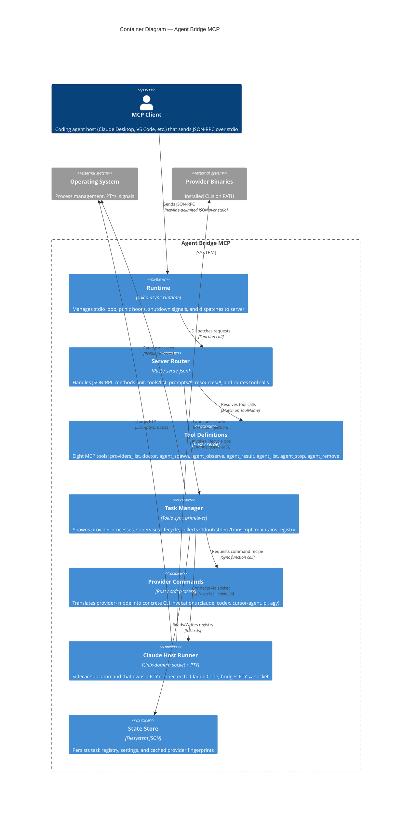

# Container Diagram (C4 Level 2)

**Last verified:** 2026-06-07

This diagram shows the major technical building blocks inside `agent-bridge-mcp` and how they communicate.

## Containers

| Container | Technology | Purpose | Port/File |
|-----------|-----------|---------|-----------|
| Runtime | Tokio (rt-multi-thread) | Event loop, signal handling, stdio buffering | stdin/stdout descriptors |
| Server Router | Rust, serde_json | JSON-RPC dispatch, method routing, response formatting | N/A (in-process) |
| Tool Definitions | Rust, serde | Schema generation, input deserialization, annotation hints | N/A (in-process) |
| Task Manager | Tokio (sync, process, fs) | Process supervision, registry CRUD, observation streaming | `AGENT_BRIDGE_STATE_DIR` |
| Provider Commands | Rust, std::process | CLI arg construction, environment filtering, timeout defaults | N/A (in-process) |
| Claude Host Runner | pty-process, tokio net | Interactive PTY ownership for Claude; bridges to Unix socket | Unix socket path (configured) |
| State Store | tokio::fs, serde_json | Persisted registry, settings, fingerprint cache | `${STATE_DIR}/registry/*.json` |

## Communication Patterns

| From | To | Protocol | Auth | Notes |
|------|---|----------|------|-------|
| MCP Client | Runtime | ND-JSON over stdio | Implicit (subprocess trust) | Parent process relationship; server is spawned by MCP host |
| Runtime | Server | Function call | N/A | Single-threaded request handling within async runtime |
| Server | Task Manager | Async function calls | N/A | Internal module interface |
| Task Manager | OS Shell | POSIX fork/exec | PATH lookup | Restricted env whitelist per provider |
| Task Manager | Claude Host Runner | Custom framed protocol over Unix socket | FS permissions (socket owner) | Only for Claude provider; host runner must be started externally |
| Task Manager | State Store | Async file I/O | OS filesystem permissions | JSON-serialized registry records |
