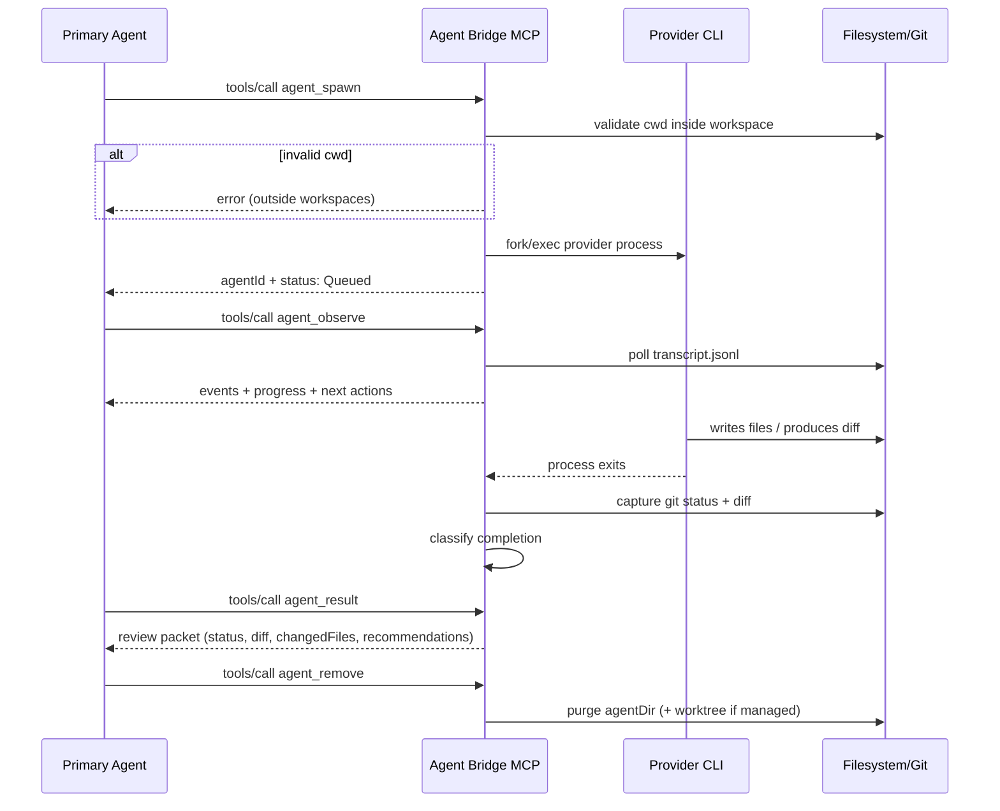
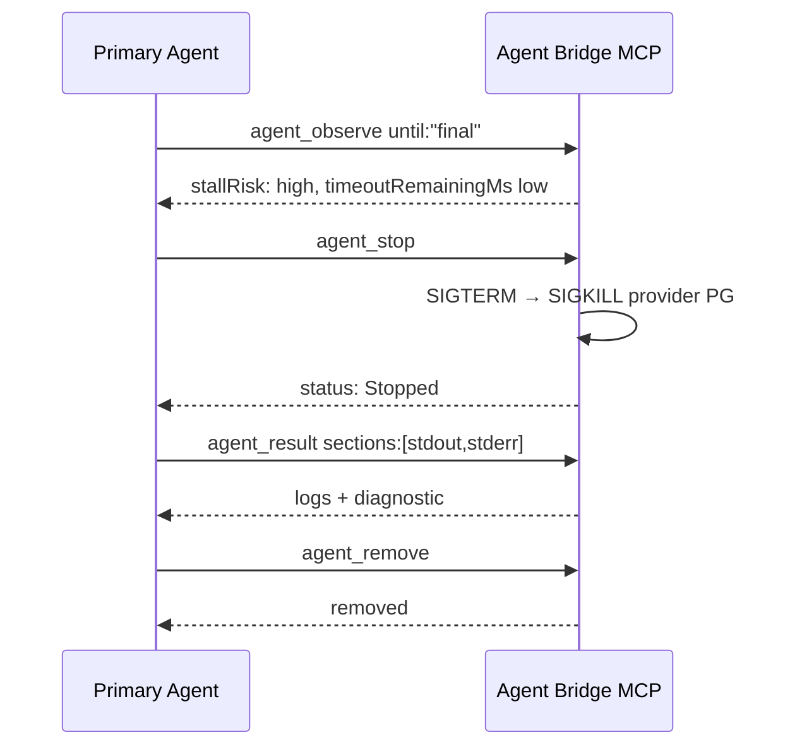
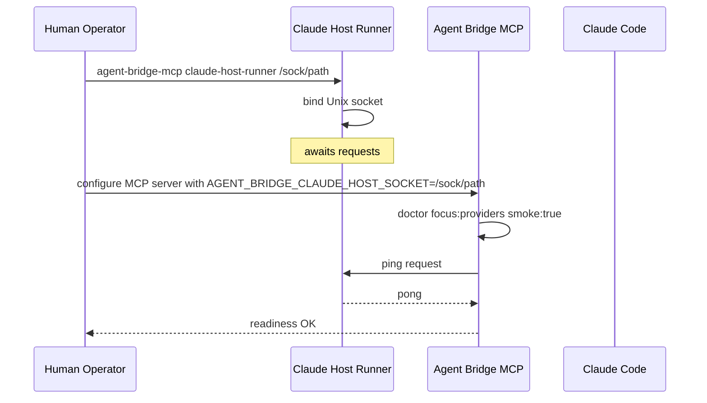

# Business Context

**Last verified:** 2026-06-07
**Sources:** Project description and codebase analysis (no user-provided business context beyond the initial description)

## Domain Overview

Agent Bridge MCP operates in the **developer tooling / agent orchestration** domain. It serves a single customer: a primary coding agent (such as Claude Desktop, Kimi/Pi, or another MCP-enabled client) that occasionally needs to offload bounded work to specialist local agents. Rather than replacing the primary agent, Agent Bridge acts as a neutral broker — it launches, tracks, and surfaces evidence from provider agents, while insisting that the caller retain responsibility for verification.

## Domain Glossary

| Term | Definition | Code Representation | Source |
|------|------------|---------------------|--------|
| Agent | Synonym for a delegated task record consumed by the MCP client | `TaskRecord` with `agentId` | Code |
| Bridge | Launch profile that wraps the provider with safety affordances (reductions, caps, timeouts) | `LaunchProfile::Bridge` | Code |
| Bare | Launch profile that invokes the provider with minimal wrapping | `LaunchProfile::Bare` | Code |
| Caller | The upstream MCP client (coding agent) that sends JSON-RPC requests | Implied `stdin` consumer | Code |
| Doctor | Built-in readiness and setup diagnostics tool | `ToolName::Doctor` | Code |
| Dry run | Preview mode for `agent_spawn` that computes the command without executing | `dry_run: true` in `TaskPreviewInput` | Code |
| Failure category | Typed taxonomy for why a provider failed | `FailureCategory` enum | Code |
| Host runner | Sidecar process owning a PTY for Claude interactive mode | `claude-host-runner` subcommand | Code |
| Isolation | Strategy for separating provider mutations from the caller's working directory | `Isolation::None` / `Worktree` | Code |
| Mode | Kind of work requested from the provider | `TaskMode`: `research`, `review`, `implement`, `command` | Code |
| Observation | Streaming or polling retrieval of transcript events and progress | `agent_observe` tool | Code |
| Presentation actions | Capability vocabulary describing what a caller can do next | `presentation_actions()` in `provider.rs` | Code |
| Provider | A local CLI agent capable of accepting delegated work | `ProviderKind`: `claude`, `cursor`, `kimi`, `codex`, `forge`, `antigravity` | Code |
| Review packet | Summarized evidence (status, diff, changed files, recommendations) returned by `agent_result` | `review_packet()` in `review.rs` | Code |
| Stall risk | Heuristic computed from elapsed time and provider output cadence | `stall_risk` field in progress JSON | Code |
| Transcript | Append-only JSON Lines log of provider stdout, stderr, and lifecycle events | `transcript.jsonl` per task | Code |
| Worktree | Disposable git worktree created for isolated implementation tasks | Created via `create_worktree()` in `spawn.rs` | Code |

## User Personas

This system is designed for a **single operator** — the human configuring the MCP server and the primary AI agent invoking it. There are no differentiated user roles, RBAC policies, or multi-persona permission matrices. Security boundaries are environmental (filesystem permissions, workspace roots, process sandboxing) rather than role-based.

### Operator (Human)

- **Who they are:** Software engineer or power user who configures MCP clients and installs provider CLIs.
- **Responsibilities:** Set `AGENT_BRIDGE_WORKSPACES`, start the Claude host runner if needed, interpret `doctor` output, and verify provider results before committing changes.

### Primary Agent (LLM)

- **Who they are:** The upstream coding agent consuming the MCP server over stdio.
- **Capabilities:** Full CRUD-equivalent over the task lifecycle via the eight MCP tools. No restrictions beyond what the tool schemas permit.

## Business Rules

### Delegation Rules

| Rule | Description | Verification | Enforced In | Notes |
|------|-------------|-------------|-------------|-------|
| Workspace containment | Tasks may only run inside declared workspace roots | Verified | `spawn.rs` (`safe_cwd`) | Rejects `..` segments and paths outside `AGENT_BRIDGE_WORKSPACES` |
| Prompt length cap | Prompts cannot exceed 100 KiB | Verified | `tools.rs` (`MAX_PROMPT_BYTES`) | Protects against accidental paste bombs |
| Timeout clamp | Effective timeout clamps to [1s, 1800s] | Verified | `domain.rs` (`TimeoutSeconds`) | Prevents absurd budgets |
| Unknown argument rejection | Public tool inputs reject extra fields | Verified | `tools.rs` (`deny_unknown_fields`) | Defensive against hallucinated parameters |
| Max concurrent tasks | Ceiling of 16 active tasks unless overridden | Verified | `task.rs` (`DEFAULT_MAX_ACTIVE_TASKS`) | Prevents resource exhaustion |

### Provider Rules

| Rule | Description | Verification | Enforced In | Notes |
|------|-------------|-------------|-------------|-------|
| Mode validation | Only provider-supported modes may be requested | Verified | `provider.rs` capabilities map | E.g., Cursor lacks `command` mode |
| Profile validation | Only advertised profiles may be specified | Verified | `provider.rs` capabilities map | `bridge` / `bare` |
| Claude host runner requirement | Claude cannot launch without a reachable host socket | Verified | `spawn.rs` (`launch_task`) | Falls back to error if socket missing |
| Denial detection | Certain stderr patterns trigger immediate termination | Verified | `supervision.rs` (`drain_log` loop polls stderr) | Primarily for Codex sandbox denials |
| Output acceptability | Some providers require parseable stdout | Verified | `complete.rs` (`classify_success_exit`) | E.g., Claude parser validates JSON shapes |

### Lifecycle Rules

| Rule | Description | Verification | Enforced In | Notes |
|------|-------------|-------------|-------------|-------|
| Valid status transitions | Only permitted edges are legal | Verified | `review.rs` (`transition_status`) | Illegal transitions return error |
| Resume unsupported | Crashed-server orphans become `FailedStale` | Verified | `task.rs` startup reconciliation | Automatic worktree reclamation attempted |
| Inspection-before-cleanup | `agent_remove` warns if `result_inspected_at` is absent | Verified | `review.rs` (`next_actions`) | Recommendations, not hard blocks |
| Retry for transients | Retries allowed only on `is_transient()` categories | Verified | `domain.rs` (`FailureCategory::is_transient()`) | Rate limits, timeouts, disconnects |

## Key Workflows

### Delegate a Review Task

**Actors:** Primary Agent (LLM), Agent Bridge MCP, Provider CLI (e.g., Codex)
**Trigger:** Caller sends `agent_spawn` with `mode: "review"`

**Accuracy notes:** Verified against `server.rs` (`handle_agent_observe`, `handle_agent_result`), `spawn.rs`, `complete.rs`.

### Recover from a Stalled Task

**Actors:** Primary Agent, Agent Bridge MCP
**Trigger:** `agent_observe` reports `stallRisk: "high"`

**Accuracy notes:** Matches `review.rs` `next_actions` recommendation chain and `supervision.rs` termination logic.

### Claude-Host-Runner Setup

**Actors:** Human Operator, Claude Host Runner, Agent Bridge MCP
**Trigger:** Human wants to use Claude provider

**Accuracy notes:** Derived from `claude_host.rs` protocol and `provider.rs` readiness contract.

## Tenant-Specific Behavior

Not applicable. Single-tenant desktop tool.
