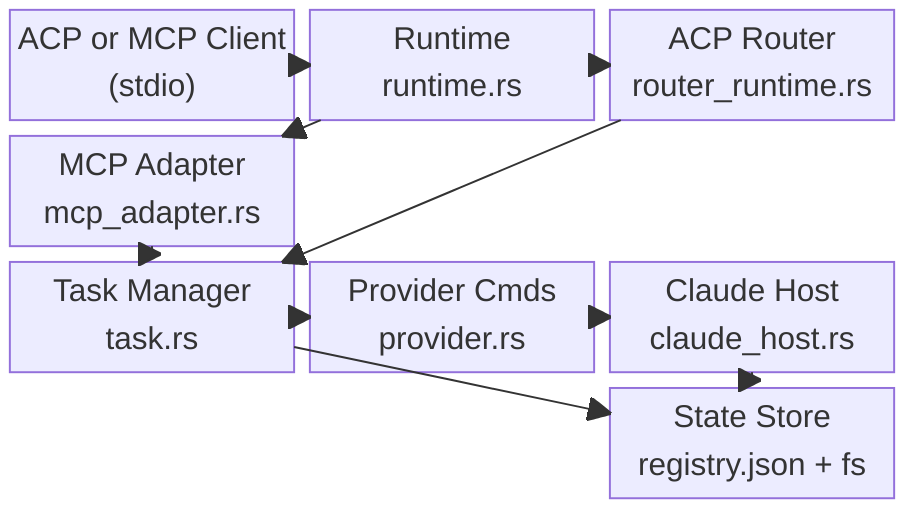

# Codemaps

**Last Updated:** 2026-06-20

## Architecture Overview

## Module Heatmap

Approximated from commit frequency and structural centrality:

| Rank | Module Area | Approximate Commit Hits | Lives Today? |
|------|-------------|------------------------|--------------|
| 1 | `src/task.rs` + submodules | Very High | Yes |
| 2 | `src/router_runtime.rs` + `src/mcp_adapter.rs` | Very High | Yes |
| 3 | `src/provider.rs` | High | Yes |
| 4 | `src/claude_interactive/` | Medium-High | Yes |
| 5 | `src/server.rs` + diagnostics.rs | Medium | Yes |
| 6 | `src/runtime.rs` | Low | Yes |
| 7 | `src/mcp.rs` | Low | Yes |
| 8 | `src/domain.rs` | Low | Yes |
| 9 | `src/claude_host.rs` | Medium | Yes |

## Codemaps

| Area | File | Description |
|------|------|-------------|
| Backend | [backend.md](backend.md) | ACP router, MCP adapter, task lifecycle, runtime, and domain types |
| Integrations | [integrations.md](integrations.md) | Provider adapters, Claude host runner, and CLI bindings |
| State Store | [state-store.md](state-store.md) | Registry persistence, JSON state, and filesystem layout |
