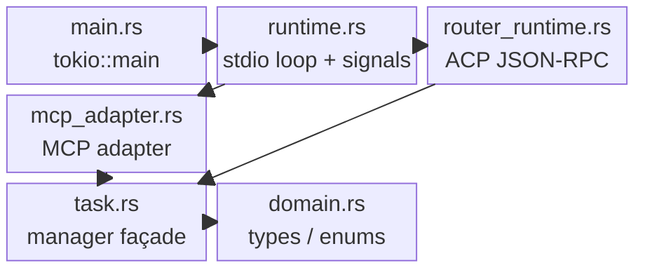

# Backend Codemap

**Last Updated:** 2026-06-20
**Entry Points:** `src/main.rs`, `src/runtime.rs`, `src/router_runtime.rs`, `src/mcp_adapter.rs`, `src/task.rs`

## Architecture

## Key Modules

| Module | Purpose | Exports | Dependencies |
|--------|---------|---------|--------------|
| `main.rs` | Binary entrypoint | `main()` | `runtime::main_entry` |
| `runtime.rs` | CLI parsing, stdio loop selection, panic hook, shutdown signal handling, host-runner subcommand routing | `main_entry()` | `mcp`, `router_runtime`, `mcp_adapter`, `server`, `task`, `claude_host`, `libc` |
| `router_runtime.rs` | Default ACP stdio runtime (`initialize`, `session/new`, `session/prompt`) | `run_stdio()`, `execute_prompt_turn()` | `mcp`, `router`, `task` |
| `mcp_adapter.rs` | Compatibility MCP surface (`agent_delegate`, `agent_evidence`) | `run_stdio()` | `mcp`, `task` |
| `server.rs` | Internal diagnostics wrapper for provider smoke/readiness | `doctor_report()` | `diagnostics` |
| `server/diagnostics.rs` | Provider readiness/smoke diagnostics | `doctor()` | `provider`, `env`, `tokio::process` |
| `task.rs` | Facade + `TaskManagerHandle` singleton + `TaskActor` message loop | `TaskManagerHandle`, `TaskRecord`, `Registry` | `task/*` submodules |
| `task/registry.rs` | Atomic registry load/save, legacy normalization, temp cleanup | `load_registry`, `save_registry`, `validate_registry_text` | `tokio::fs`, `serde_json` |
| `task/spawn.rs` | Argument validation, worktree creation, process launch, host-runner bridging | `validate_spawn_arguments`, `launch_task`, `safe_cwd` | `tokio::process`, `provider`, `domain` |
| `task/supervision.rs` | PID registry, process groups, signal termination, stdout/stderr draining | `register_active_pid`, `wait_for_child`, `drain_log` | `tokio::io`, `libc` |
| `task/complete.rs` | Completion classification, host-response ingestion, transcript scanning, git snapshots | `classify_completion`, `scan_partial_results`, `git_snapshot` | `std::fs`, `serde_json` |
| `task/review.rs` | Payload shaping, progress calculation, `next` action lists, listing/filtering | `public_task`, `observe_payload`, `review_packet`, `list_tasks` | `chrono`, `serde_json` |
| `domain.rs` | Core enums and strongly-typed wrappers | `ProviderKind`, `TaskMode`, `TaskStatus`, `FailureCategory`, `TimeoutSeconds`, `WorktreeName` | `serde` |
| `mcp.rs` | Plain JSON-RPC 2.0 types | `JsonRpcRequest`, `JsonRpcResponse`, `JsonRpcId`, `JsonRpcError` | `serde` |

## Data Flow

1. **Request arrival:** Client writes ND-JSON to stdin. `runtime.rs` deserializes into `JsonRpcRequest`.
2. **Runtime selection:** no subcommand runs `router_runtime`; `mcp-adapter` runs `mcp_adapter`.
3. **Public dispatch:** ACP requests route through `session/prompt`; MCP compatibility calls route through `agent_delegate` or `agent_evidence`.
4. **Task lifecycle:** `TaskManagerHandle` serializes commands through an async MPSC channel to the `TaskActor`.
5. **Actor execution:** `TaskActor::run` processes actor commands against in-memory registry and filesystem state.
6. **Spawn path:** `spawn.rs` validates, creates a worktree when requested, builds `ProviderCommand`, launches the provider, registers PID, and begins IO drains.
7. **Supervision path:** `supervision.rs` `wait_for_child` polls exit status, timeout, and stderr denial. On completion, signals are escalated (SIGTERM to SIGKILL).
8. **Classification path:** `complete.rs` reads captured stdout/stderr, classifies exit status, builds `TaskCompletion`, and saves it to the registry.
9. **Evidence path:** `review.rs` reads the registry and transcript JSONL, computing summaries, bounded evidence, and `next` action lists.
10. **Response:** The selected runtime wraps the result/error in `JsonRpcResponse` and writes ND-JSON to stdout.

## External Dependencies

| Crate | Purpose | Version |
|-------|---------|---------|
| `tokio` | Async runtime, process mgmt, IO, signals, channels | 1.52 |
| `serde` + `serde_json` | Serialization with `preserve_order` | 1.0 |
| `chrono` | Timestamps for registry/events | 0.4 |
| `uuid` | Unique temp filenames and agent IDs | 1.23 |
| `libc` | Signals, process groups, killpg | 0.2 |
| `pty-process` | Pseudo-terminal allocation for Claude | 0.5 |

## Related Areas

- [Integrations](integrations.md) — Provider command construction and Claude host runner wire protocol
- [State Store](state-store.md) — Registry persistence and filesystem layout
