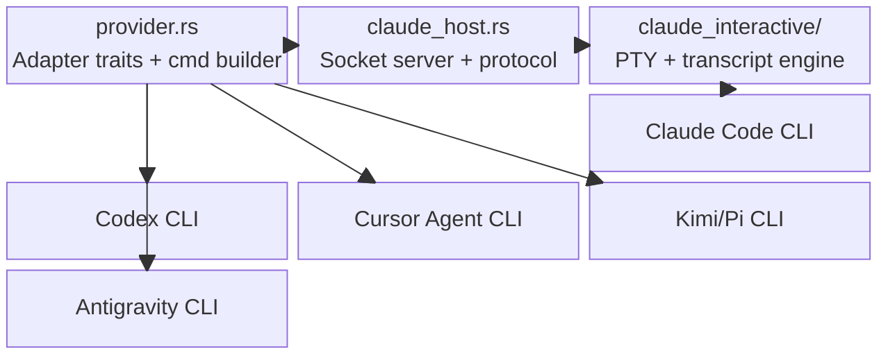

# Integrations Codemap

**Last Updated:** 2026-06-07
**Entry Points:** `src/provider.rs`, `src/claude_host.rs`, `src/claude_interactive/runner.rs`

## Architecture

## Key Modules

| Module | Purpose | Exports | Dependencies |
|--------|---------|---------|--------------|
| `provider.rs` | Defines provider capabilities, constructs CLI commands per provider+mode, supplies environment filtering and denial detection | `ProviderCommand`, `ProviderTask`, `capabilities()`, `adapter_for()` | `domain`, `std::env`, `serde_json` |
| `claude_host.rs` | Unix socket server, request framing, host-result decoding, socket-path discovery | `ClaudeHostCommand`, `HostRequest`, `HostResponse`, `run_server()`, `socket_path_from_env()` | `tokio::net`, `serde` |
| `claude_interactive/runner.rs` | Orchestrates the interactive Claude run: PTY spawn, prompt injection, transcript capture, stop/failure classification | `run_interactive()`, `ClaudeInteractiveRunRequest`, `ClaudeInteractiveRunResult` | `pty-process`, `tokio` |
| `claude_interactive/pty.rs` | PTY abstraction (`PtySpawn`, `PtySession`, `PtySize`) | `spawn()`, `resize()` | `pty-process` |
| `claude_interactive/hooks.rs` | Parses Claude hook/settings JSON from terminal output | Hook parsing utilities | `serde_json` |
| `claude_interactive/setup.rs` | Detects and responds to Claude setup prompts (login, workspace trust) | Setup prompt matchers | `regex` implied |
| `claude_interactive/transcript.rs` | Transcript line classification and event emission | Transcript parsing | `serde_json` |
| `claude_interactive/terminal.rs` | Terminal emulator state for ANSI stream interpretation | Terminal state machine | `vt100`/ansi libs |
| `claude_interactive/failure.rs` | Mapping of Claude stop failures to `FailureCategory` | Failure classification | `domain` |

## Data Flow

1. **Capability inquiry:** `providers_list` calls `provider::capabilities()` returning a JSON map of every provider's supported modes, profiles, cadences, and readiness.
2. **Smoke / doctor:** `doctor` iterates providers, constructing minimal commands via `provider::minimal_smoke_command()` and executing them to verify launchability.
3. **Normal spawn:** `task/spawn.rs` calls `provider::prepare_command(...)` receiving a populated `ProviderCommand` with `command`, `args`, `cwd`, `env`, `stdin`, and `redactions`.
4. **Direct fork/exec:** For non-Claude providers, `launch_task` clears env, sets allowlisted vars, spawns the process, and attaches IO drains.
5. **Claude host path:** `launch_task` detects Claude + socket availability, converts `ProviderCommand` into a `ClaudeHostCommand`, and hands off to `launch_host_runner_task`.
6. **Host runner task:** `run_host_task` connects to the Unix socket, sends a framed `HostRequest` (`RunClaude`), and awaits the `HostResponse`.
7. **Interactive engine:** Inside the host runner, `claude_host.rs` accepts the socket request, then calls `run_interactive()` which opens a PTY, spawns `claude`, injects the prompt via keystrokes, and consumes the ANSI stream until stop/failure/timeout.
8. **Result marshalling:** Host runner packs stdout, stderr, transcript, failure category, and optional result into a `HostResponse` frame. `complete.rs` ingests this as `complete_host_response()`.

## External Dependencies

| Crate | Purpose | Version |
|-------|---------|---------|
| `pty-process` | Async-friendly PTY master/slave pairs | 0.5 |
| `libc` | Unix-specific signals and process groups | 0.2 |
| `tokio` | Unix sockets, async IO, process spawning | 1.52 |

## Related Areas

- [Backend](backend.md) — Task lifecycle and server dispatch
- [State Store](state-store.md) — Where captured stdout/stderr/transcripts land
