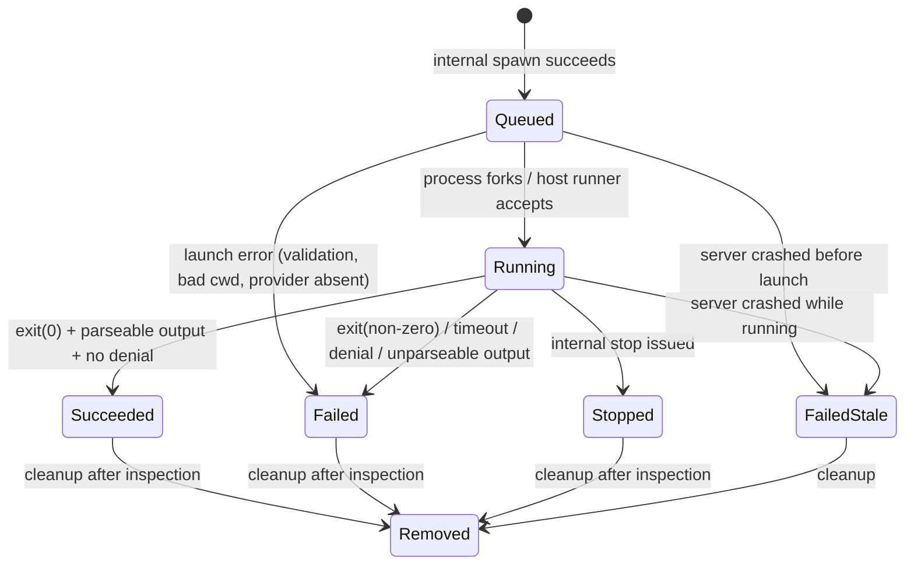
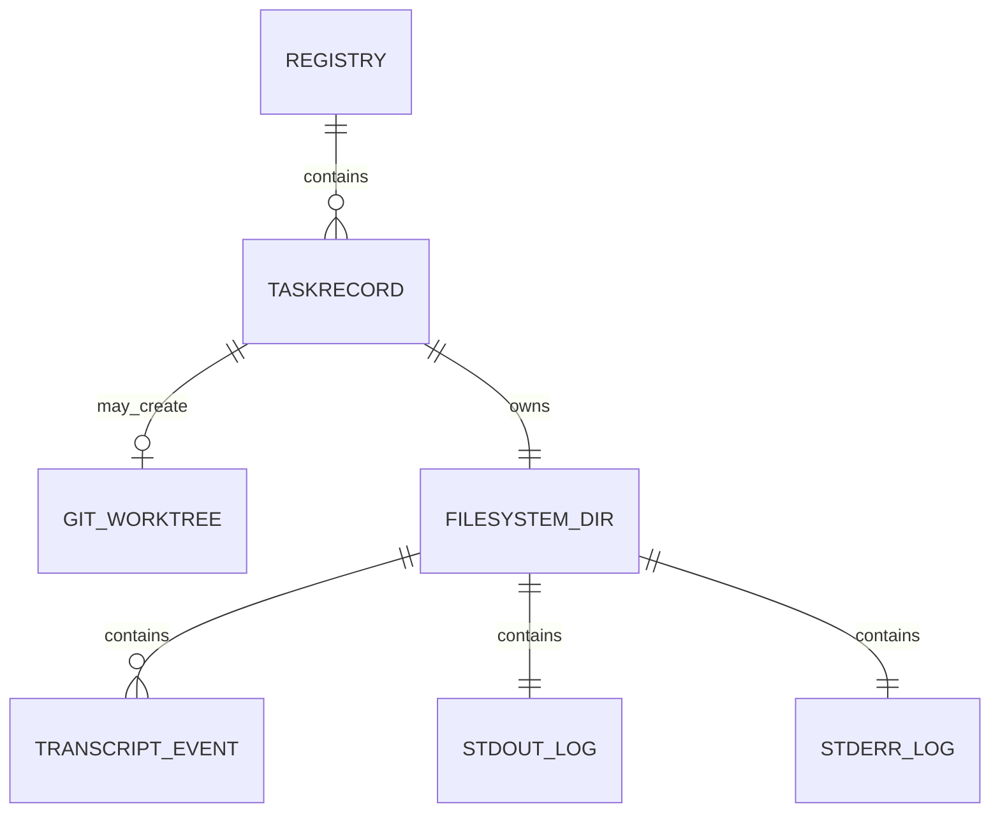

# Data Model

**Last verified:** 2026-06-16
**Schema source:** `crates/agent-bridge-mcp/src/task.rs` (lines 926–980+)

## Core Entities

### TaskRecord

**What it represents:** A single delegated agent task — a unit of work handed to a provider CLI (e.g., "review this PR", "implement this feature") along with its entire lifecycle history, captured output, and review evidence.

**Key fields:**

| Field | Type | Business Meaning |
|-------|------|-----------------|
| `agentId` | UUID string | Canonical identifier for the task (formerly `taskId`; legacy normalized on load) |
| `provider` | Enum (`claude`…`antigravity`, including `forge`) | Which provider agent executed the work |
| `mode` | Enum (`research`,`review`,`implement`,`command`) | Nature of the requested work |
| `title` | Optional string | Human-readable label for the task |
| `status` | Enum (`Queued`,`Running`,`Succeeded`,`Failed`,`Stopped`,`FailedStale`,`Removed`) | Current phase of the lifecycle |
| `cwd` | String | Working directory where the provider ran (possibly a managed git worktree) |
| `originalCwd` | Optional string | Original caller-specified directory before worktree redirection |
| `isolation` | Enum (`None`,`Worktree`) | Whether the task ran in a disposable git worktree |
| `worktreeManaged` | Boolean | True if Agent Bridge created and owns the worktree |
| `worktreePath` | Optional string | Absolute path to the git worktree, if any |
| `agentDir` | String | Private directory storing stdout.log, stderr.log, transcript.jsonl |
| `pid` | Optional uint32 | OS process ID of the spawned provider child |
| `timeoutSeconds` | int64 | Wall-clock budget allocated to the provider |
| `profile` | Enum (`Bridge`,`Bare`,`Unblocked`) | Launch strategy hint; `unblocked` applies provider-specific permission bypass flags after workspace validation |
| `exitCode` | Optional int32 | OS exit code of the provider process |
| `signal` | Optional string | Signal name if the process terminated by signal |
| `error` | Optional string | Human-readable error summary |
| `errorType` | Enum (`Timeout`,`ProviderExitError`,…) | Taxonomy bucket for programmatic handling |
| `diagnostic` | Optional JSON | Rich structured diagnostic snapshot (redacted excerpts, failure category) |
| `gitStatus` | Optional string | Short-form git status of the working directory at completion |
| `gitDiff` | Optional string | Diff patch produced by the provider |
| `changedFiles` | Optional string[] | Filenames modified, obtained via `git diff --name-only` |
| `resultInspectedAt` | Optional ISO8601 | Timestamp when the result reader first returned evidence |
| `transcriptAvailable` | Boolean | Whether transcript.jsonl exists and has readable events |
| `finalResultDetected` | Boolean | Whether a conclusive `provider_result` event was recorded |
| `partialResultDetected` | Boolean | Whether partial output events exist without a final result |
| `partialResults` | Array | Last-mile provider events harvested from the transcript tail |
| `createdAt` | ISO8601 | When the task was queued |
| `updatedAt` | ISO8601 | Last mutation timestamp (status change, observation, etc.) |

**Relationships:**

- Stored inside a `Registry` (BTreeMap keyed by `agentId`)
- Associated with a private directory tree on the filesystem (`${STATE_DIR}/tasks/${agentId}/`)
- Linked to zero or one git worktree (managed or unmanaged)

**Lifecycle:**

### Registry

**What it represents:** The entire persisted universe of tasks known to this Agent Bridge server instance.

**Key fields:**

| Field | Type | Business Meaning |
|-------|------|-----------------|
| `tasks` | Object mapping `agentId` → `TaskRecord` | Opaque BTreeMap ensuring stable serialization order |

**Persistence:**

- Saved atomically to `${STATE_DIR}/registry.json` via write-to-temp + rename.
- Temp files named `registry.json.tmp-{pid}-{uuid}` are cleaned up on load.
- Legacy fields (`taskId`, `taskDir`) are normalized to `agentId`/`agentDir` on deserialization.

## Entity Relationship Diagram

## Multi-Tenant Data Isolation

Not applicable. Agent Bridge MCP is a single-tenant desktop tool. Concurrent access is limited to the single MCP client process connected over stdio.

## Audit Trail

No formal audit trail. However, the `transcript.jsonl` file in each task directory constitutes a chronological, append-only event log of everything the provider emitted. Redaction rules scrub sensitive tokens at write time.

## Schema Conventions

| Convention | Example | Rationale |
|------------|---------|-----------|
| camelCase JSON fields | `agentId`, `resultInspectedAt` | Matches MCP ecosystem conventions |
| snake_case Rust identifiers | `agent_id`, `result_inspected_at` | Idiomatic Rust |
| `skip_serializing_if` for empties | `#[serde(skip_serializing_if = "Option::is_none")]` | Keeps lean response payloads |
| Atomic temp+rename writes | `registry.json.tmp-*` → `registry.json` | Prevents corruption on crash mid-write |
