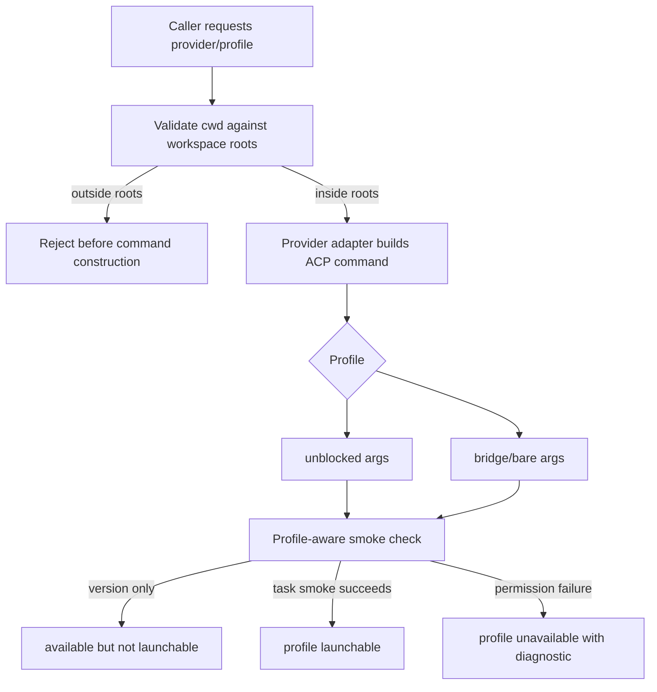

# feat: Add unblocked provider discovery

## Summary

Add an explicit `unblocked` launch profile for ACP providers and make provider readiness prove workspace read/write reach before advertising a provider/profile as launchable. The bridge keeps workspace validation authoritative and uses provider-adapter-owned flags rather than a generic permission-bypass command shape.

---

## Problem Frame

The bridge already validates task `cwd` against configured workspace roots and launches providers through ACP only. That protects callers, but provider CLIs can still block writes inside the current workspace unless they receive provider-specific permission-bypass flags.

The goal is not to make Agent Bridge a general sandbox escape. The goal is to let callers opt into a clearly visible provider profile that can work inside the current workspace envelope and fail discovery before real tasks when that profile cannot reach the workspace.

---

## Requirements

**Workspace Reach**

- R1. The default workspace policy continues to use the current runtime workspace when no explicit bridge workspace list is configured.
- R2. Every launch profile, including `unblocked`, must pass existing `cwd` validation before command construction.
- R3. Permission failures during discovery or smoke checks must mark the provider/profile unavailable rather than weakening workspace validation.

**Provider Discovery**

- R4. Discovery must stay ACP-only and bounded to known provider adapters.
- R5. Readiness must distinguish version availability from profile-specific task launchability.
- R6. No prompt-mode fallback may be added for providers that fail ACP discovery.

**Unblocked Profile**

- R7. `unblocked` must be a first-class launch profile in schemas, provider capabilities, preview output, task records, and result diagnostics.
- R8. Permission-bypass flags must be owned by provider adapters and applied only for `unblocked`.
- R9. Normal `bridge` and `bare` behavior must remain unchanged.
- R10. Readiness and diagnostics must make unsupported or failed unblocked behavior visible.

---

## Key Technical Decisions

- **First-class profile over hidden modifier:** `LaunchProfile::Unblocked` extends the existing launch-profile contract, so previews, task records, result packets, and provider capabilities remain coherent.
- **Adapter-owned flags:** each provider adapter owns its unblocked arguments and diagnostics because the flag names and safety semantics are provider-specific.
- **Reuse readiness machinery:** `doctor focus:"providers"` already has version and smoke probes, bounded timeouts, diagnostics, and fake-provider test coverage.
- **Smoke with provider workspace write reach:** unblocked launchability must be proven by a bounded provider-performed write/read/delete probe inside the validated `cwd`, not just by seeing the provider answer a prompt.
- **No new dependencies:** command discovery can use existing env/PATH resolution and stdlib filesystem checks.

---

## High-Level Technical Design

The provider kind remains a closed enum. Discovery means resolving known ACP-capable provider commands from explicit env settings and safe defaults, then proving each requested profile with readiness checks.

---

## Implementation Units

### U1. Add the unblocked launch profile

- **Goal:** Add `unblocked` to the typed launch-profile surface without changing default behavior.
- **Requirements:** R7, R9.
- **Dependencies:** None.
- **Files:**
  - `crates/agent-bridge-mcp/src/domain.rs`
  - `crates/agent-bridge-mcp/src/tools.rs`
  - `crates/agent-bridge-mcp/src/provider.rs`
  - `crates/agent-bridge-mcp/tests/stdio_binary.rs`
  - `crates/agent-bridge-mcp/tests/server_protocol.rs`
- **Approach:** Extend `LaunchProfile::ALL`, schema enum generation, provider capabilities, and profile diagnostics so `unblocked` is visible wherever `bridge` and `bare` are visible.
- **Patterns to follow:** Existing `Bridge` / `Bare` serialization and `profile_diagnostics()` entries.
- **Test scenarios:**
  - `crates/agent-bridge-mcp/tests/stdio_binary.rs`: `providers_list` includes `unblocked` in `launchProfiles` for providers that support it.
  - `crates/agent-bridge-mcp/tests/stdio_binary.rs`: `agent_spawn dryRun:true` with no profile still reports `bridge`.
  - `crates/agent-bridge-mcp/tests/server_protocol.rs`: tool schema advertises `unblocked` as a valid `profile`.
- **Verification:** Public schema and provider metadata expose `unblocked`, while default previews remain unchanged.

### U2. Move unblocked command behavior into provider adapters

- **Goal:** Apply provider-specific permission-bypass flags only when `profile: "unblocked"` is requested.
- **Requirements:** R4, R6, R8, R9.
- **Dependencies:** U1.
- **Files:**
  - `crates/agent-bridge-mcp/src/provider.rs`
  - `crates/agent-bridge-mcp/tests/stdio_binary.rs`
- **Approach:** Add adapter methods for profile support and profile-specific ACP args. Start with a conservative provider matrix: support only providers whose ACP permission-bypass flag is known and tested, and mark the rest unsupported in diagnostics.
- **Patterns to follow:** `supported_effort()`, `supported_thinking()`, `validate()`, and existing per-provider `profile_diagnostics()` branches.
- **Test scenarios:**
  - `crates/agent-bridge-mcp/tests/stdio_binary.rs`: dry-run for a supported unblocked provider includes the expected adapter-owned permission flag.
  - `crates/agent-bridge-mcp/tests/stdio_binary.rs`: dry-run for an unsupported provider/profile combination returns a validation error before spawning.
  - `crates/agent-bridge-mcp/tests/stdio_binary.rs`: `bridge` and `bare` dry-runs for the same provider do not include unblocked flags.
- **Verification:** Command construction is profile-specific, opt-in, and impossible for unsupported provider/profile combinations.

### U3. Make provider readiness profile-aware

- **Goal:** Let readiness checks prove launchability for a selected provider/profile pair.
- **Requirements:** R3, R5, R10.
- **Dependencies:** U1, U2.
- **Files:**
  - `crates/agent-bridge-mcp/src/tools.rs`
  - `crates/agent-bridge-mcp/src/provider.rs`
  - `crates/agent-bridge-mcp/src/server/diagnostics.rs`
  - `crates/agent-bridge-mcp/tests/stdio_binary.rs`
- **Approach:** Extend `doctor` provider checks with an optional profile selector, defaulting to current behavior. Build smoke commands through the same adapter path as task launches and report profile-specific readiness without blocking static provider discovery.
- **Patterns to follow:** `providerTimeoutMs`, aggregate smoke budgets, `set_readiness()`, and fake-provider smoke tests.
- **Test scenarios:**
  - `crates/agent-bridge-mcp/tests/stdio_binary.rs`: version-only provider checks remain non-launchable.
  - `crates/agent-bridge-mcp/tests/stdio_binary.rs`: smoke for `profile: "unblocked"` reports launchable only after the unblocked smoke path succeeds.
  - `crates/agent-bridge-mcp/tests/stdio_binary.rs`: smoke timeout and failed startup diagnostics include the selected profile.
  - `crates/agent-bridge-mcp/tests/stdio_binary.rs`: invalid profile input is rejected by schema/runtime validation.
- **Verification:** `doctor focus:"providers"` can answer which profiles are launchable without changing the eight-tool surface.

### U4. Add workspace reach smoke coverage

- **Goal:** Prove unblocked providers can read/write inside the validated workspace before real work is delegated.
- **Requirements:** R1, R2, R3, R5.
- **Dependencies:** U2, U3.
- **Files:**
  - `crates/agent-bridge-mcp/src/provider.rs`
  - `crates/agent-bridge-mcp/src/server/diagnostics.rs`
  - `crates/agent-bridge-mcp/src/task/spawn.rs`
  - `crates/agent-bridge-mcp/tests/stdio_binary.rs`
- **Approach:** Keep `safe_cwd()` as the gate before any smoke command is built. For unblocked smoke, ask the provider to perform a bounded marker-file operation in the validated `cwd` and classify write denial as provider/profile unavailability.
- **Patterns to follow:** `safe_cwd()`, Codex sandbox denial diagnostics, and existing provider smoke result shaping.
- **Test scenarios:**
  - `crates/agent-bridge-mcp/tests/stdio_binary.rs`: smoke with a `cwd` outside configured workspaces is rejected before invoking the fake provider.
  - `crates/agent-bridge-mcp/tests/stdio_binary.rs`: a fake provider that refuses the workspace write reports `launchable: false` with a permission diagnostic.
  - `crates/agent-bridge-mcp/tests/stdio_binary.rs`: a successful unblocked smoke cleans up its marker file.
  - `crates/agent-bridge-mcp/tests/stdio_binary.rs`: symlink escape protection remains enforced for unblocked profile previews and smokes.
- **Verification:** Permission failures are observable readiness failures, not validation bypasses.

### U5. Surface unblocked diagnostics in task lifecycle outputs

- **Goal:** Make unblocked usage auditable after preview, spawn, observation, and result inspection.
- **Requirements:** R7, R9, R10.
- **Dependencies:** U1, U2.
- **Files:**
  - `crates/agent-bridge-mcp/src/server.rs`
  - `crates/agent-bridge-mcp/src/task.rs`
  - `crates/agent-bridge-mcp/src/task/review.rs`
  - `crates/agent-bridge-mcp/src/guidance.rs`
  - `crates/agent-bridge-mcp/tests/stdio_binary.rs`
  - `crates/agent-bridge-mcp/tests/server_protocol.rs`
- **Approach:** Reuse existing `profile`, `promptStrategy`, and `profileDiagnostics` fields. Add unblocked-specific diagnostics describing applied flags, unsupported providers, and the fact that workspace validation remains authoritative.
- **Patterns to follow:** Existing dry-run preview output and review-packet profile metadata.
- **Test scenarios:**
  - `crates/agent-bridge-mcp/tests/stdio_binary.rs`: dry-run redacts prompts while showing unblocked profile diagnostics.
  - `crates/agent-bridge-mcp/tests/stdio_binary.rs`: completed task result includes `profile: "unblocked"` and profile diagnostics.
  - `crates/agent-bridge-mcp/tests/server_protocol.rs`: guidance names unblocked as opt-in and warns against using it as a reflex for review/research tasks.
- **Verification:** A caller can tell that a task used unblocked mode without reading logs or source.

### U6. Update docs and specs

- **Goal:** Keep security, provider, and launch-profile documentation aligned with the new behavior.
- **Requirements:** R4, R6, R7, R10.
- **Dependencies:** U1-U5.
- **Files:**
  - `docs/agents/security.md`
  - `docs/SECURITY.md`
  - `docs/DOCUMENTATION.md`
  - `openspec/specs/task-launch-profiles/spec.md`
  - `openspec/specs/provider-readiness-contract/spec.md`
  - `openspec/specs/provider-adapter-contract/spec.md`
- **Approach:** Document `unblocked` as an opt-in profile that may increase provider reach inside a validated workspace, not as a replacement for workspace confinement or an arbitrary provider launcher.
- **Patterns to follow:** Existing launch-profile and readiness specs.
- **Test scenarios:**
  - Test expectation: none -- documentation/spec updates are validated by review and the existing quality script.
- **Verification:** Docs state the security boundary plainly and preserve the ACP-only decision.

---

## Acceptance Examples

- AE1. **Current workspace default.**
  - **Given:** no explicit bridge workspace list is configured.
  - **When:** a provider task or profile smoke is requested in the current workspace.
  - **Then:** the bridge validates that workspace as the effective root before command construction.

- AE2. **Unblocked smoke failure.**
  - **Given:** a provider can answer `--version` but cannot write inside the validated workspace under `unblocked`.
  - **When:** provider readiness runs with smoke enabled for `unblocked`.
  - **Then:** the provider/profile is not launchable and reports a permission diagnostic.

- AE3. **No prompt-mode fallback.**
  - **Given:** a prompt-mode binary exists but no ACP command can be resolved.
  - **When:** provider discovery runs.
  - **Then:** the provider remains unavailable instead of falling back to prompt mode.

---

## Scope Boundaries

- No generic arbitrary-agent discovery.
- No prompt-mode provider adapters.
- No automatic unblocked behavior for `bridge` or `bare`.
- No claim that unblocked mode exactly matches the current agent sandbox.
- No new MCP tools; extend existing schemas and diagnostics.

### Deferred to Follow-Up Work

- A broader provider capability matrix can be added after live provider flag behavior is verified across installed CLI versions.
- A richer per-profile readiness cache can be considered if repeated smoke checks become slow.

---

## Risks & Dependencies

- **Provider flag drift:** CLI vendors may rename or remove permission-bypass flags; adapter-owned tests and diagnostics keep failures local.
- **Security ambiguity:** users may read `unblocked` as unrestricted; docs and diagnostics must say workspace validation still applies.
- **Smoke side effects:** marker-file smoke must be bounded, uniquely named, and cleaned up.
- **Test flakiness:** provider readiness tests involve child processes; follow existing fake-provider patterns and run serially if process-group behavior flakes.

---

## Sources & Research

- `docs/brainstorms/2026-06-16-unblocked-provider-discovery-requirements.md`
- Project memory decision: Provider Launches Are ACP-Only
- `crates/agent-bridge-mcp/src/domain.rs`
- `crates/agent-bridge-mcp/src/provider.rs`
- `crates/agent-bridge-mcp/src/task/spawn.rs`
- `crates/agent-bridge-mcp/src/server/diagnostics.rs`
- `crates/agent-bridge-mcp/tests/stdio_binary.rs`
- `docs/agents/security.md`
- `docs/agents/guardrails.md`
- `openspec/specs/task-launch-profiles/spec.md`
- `openspec/specs/provider-readiness-contract/spec.md`
- `openspec/specs/provider-adapter-contract/spec.md`
