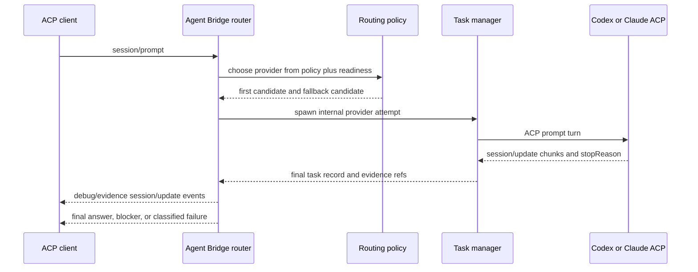

# feat: Add ACP router replacement contract

## Summary

Replace the caller-managed MCP lifecycle product contract with an ACP-facing
router contract that owns one prompt turn, policy-routes it to Codex or Claude,
streams provider internals as evidence/debug updates, and ends with one trusted
provider-authored answer, blocker, or classified failure.

The first implementation should be a reversible migration: add an explicit
ACP-router runtime path beside the existing MCP compatibility server, reuse the
current task manager and provider adapters internally, and avoid adding a ninth
MCP tool.

---

## Problem Frame

Agent Bridge already has reliable primitives: bounded provider launch,
workspace validation, worktree isolation, transcript capture, diagnostics,
completion notifications, and compact result inspection. The remaining product
gap is that callers still orchestrate lifecycle state by spawning, observing,
waiting, and inspecting tasks.

The replacement contract should make Agent Bridge feel like a native
collaboration router. A client sends a prompt turn once. The router decides
which provider should handle it, owns finality, handles only safe pre-finality
failover, and returns a terminal result without making the caller interpret raw
provider lifecycle state.

---

## Requirements

**Router Contract**

- R1. The public replacement contract models one routed prompt turn, not a
  caller-managed provider task lifecycle.
- R2. The router chooses between Codex and Claude using explicit policy inputs
  and bounded provider readiness.
- R3. Each routed turn returns a final provider-authored answer, a clear
  blocker, or a classified failure.
- R4. Transcript and diagnostic evidence remains preserved for audit and
  debugging without raw lifecycle state being the default response.

**Finality and Failover**

- R5. A completed provider-authored answer is trusted finality for that prompt
  turn.
- R6. Automatic failover is allowed only for infrastructure, readiness, or
  lifecycle failures before trusted finality.
- R7. The router must not silently fail over on auth failure, billing failure,
  user cancellation, explicit provider refusal, or a completed answer.
- R8. Any failover must be visible in diagnostics and evidence.

**Preserved Reliability Primitives**

- R9. Workspace confinement and worktree isolation remain available.
- R10. Provider readiness checks remain bounded and policy-visible.
- R11. Transcripts, stdout/stderr excerpts, and diagnostics remain inspectable.
- R12. Existing MCP lifecycle behavior may remain during migration, but it does
  not define the final replacement product contract.

---

## Key Technical Decisions

- **ACP router path, not a ninth MCP tool:** the MCP server can stay for
  compatibility while the new contract is proven, but the router surface should
  be an ACP runtime path such as an `acp-router` subcommand or explicit mode.
- **Reuse lifecycle primitives internally:** the first router implementation
  should call the existing task manager and provider adapters rather than
  duplicating process launch, worktree, transcript, or diagnostic code.
- **Codex and Claude only in v1:** the router policy accepts only Codex and
  Claude candidates even though lower-level provider adapters still support the
  broader MCP compatibility set.
- **Typed failover disposition:** classify every attempt as trusted finality,
  failover-eligible infrastructure/readiness/lifecycle failure, blocker, or
  terminal failure before any fallback decision.
- **No semantic second opinion:** explicit refusal, cancellation, auth, billing,
  and completed answers stop routing and return the first provider's outcome.
- **Evidence by reference and debug stream:** normal ACP responses carry the
  final answer or failure classification. Raw transcripts, logs, and task
  review packets stay opt-in through diagnostic references during migration.
- **No new dependencies:** use the existing Tokio, serde, serde_json, chrono,
  uuid, and provider/task infrastructure.

---

## High-Level Technical Design

The router owns the prompt turn. Internally, each provider attempt can still be
represented by a task record so existing worktree isolation, transcript capture,
provider diagnostics, and cleanup behavior remain intact.

---

## Implementation Units

### U1. OpenSpec Router Contract

- **Goal:** Add a spec-driven change that records the ACP router contract,
  migration boundary, failure dispositions, and acceptance scenarios before
  runtime behavior changes.
- **Requirements:** R1-R12.
- **Dependencies:** None.
- **Files:**
  - `openspec/changes/acp-router-replacement/proposal.md`
  - `openspec/changes/acp-router-replacement/design.md`
  - `openspec/changes/acp-router-replacement/tasks.md`
  - `openspec/changes/acp-router-replacement/specs/acp-router-contract/spec.md`
  - `openspec/changes/acp-router-replacement/specs/provider-failover-policy/spec.md`
- **Approach:** Convert the restored requirements into testable SHALL
  statements. Keep the MCP lifecycle server explicitly marked as migration
  compatibility. Define router terminal outcomes and failover eligibility in
  spec language before adding Rust types.
- **Patterns to follow:** `openspec/changes/own-claude-interactive-provider/*`
  for multi-artifact changes; `openspec/specs/provider-readiness-contract/spec.md`
  for bounded readiness language.
- **Test scenarios:**
  - Routed turn returns one terminal outcome.
  - Infrastructure/readiness/lifecycle failure before finality may fail over.
  - Refusal, cancellation, auth, billing, and completed answers do not fail
    over silently.
  - Evidence references remain available without raw lifecycle being the
    default response.
- **Verification:** `openspec validate acp-router-replacement --strict`.

### U2. Router Domain and Policy Core

- **Goal:** Define the typed router input, provider selection policy, attempt
  outcome, failure disposition, and final routed-turn result without launching
  provider processes.
- **Requirements:** R1, R2, R3, R5, R6, R7, R8, R10.
- **Dependencies:** U1.
- **Files:**
  - `crates/agent-bridge-mcp/src/domain.rs`
  - `crates/agent-bridge-mcp/src/router.rs`
  - `crates/agent-bridge-mcp/src/lib.rs`
- **Approach:** Add a small `router` module with plain data types and pure
  policy functions. Limit router candidates to `ProviderKind::Codex` and
  `ProviderKind::Claude`. Map lower-level `FailureCategory`, `ErrorType`,
  provider readiness, ACP `stopReason`, and final-result presence into a router
  disposition enum:
  `TrustedFinal`, `FailoverEligible`, `Blocker`, or `TerminalFailure`.
- **Patterns to follow:** `FailureCategory` and `LaunchProfile` in
  `domain.rs`; provider capability helpers in `provider.rs`.
- **Test scenarios:**
  - Codex/Claude policy accepts explicit primary and fallback candidates.
  - Non-Codex/Claude candidates are rejected before launch.
  - A final provider result maps to `TrustedFinal` and disables fallback.
  - Provider start failure, timeout, or closed stdout before finality can map
    to `FailoverEligible`.
  - Auth, billing, cancellation, and explicit refusal map to `Blocker`.
  - Every failover decision records source provider, target provider, reason,
    and failure category.
- **Verification:** `cargo test -p agent-bridge-mcp router`.

### U3. Internal Routed Turn Executor

- **Goal:** Execute one routed prompt turn through the existing task manager
  while hiding spawn/observe/result choreography from the router client.
- **Requirements:** R1, R3, R4, R5, R6, R8, R9, R11, R12.
- **Dependencies:** U2.
- **Files:**
  - `crates/agent-bridge-mcp/src/router.rs`
  - `crates/agent-bridge-mcp/src/task.rs`
  - `crates/agent-bridge-mcp/src/task/review.rs`
  - `crates/agent-bridge-mcp/src/task/acp.rs`
  - `crates/agent-bridge-mcp/tests/stdio_binary.rs`
- **Approach:** Add a crate-internal executor that builds normal
  `agent_spawn` arguments, calls `TaskManagerHandle`, waits for finality, and
  inspects the resulting `TaskRecord` or review packet through typed helpers.
  The executor may poll `agent_observe` internally to collect evidence events,
  but callers receive only router events and the final routed-turn result.
  Promote ACP `stopReason` into task diagnostics so refusal and cancellation do
  not get confused with retryable provider output failures.
- **Patterns to follow:** `TaskManagerHandle::spawn`, `wait`, and `result` in
  `task.rs`; `review_packet` in `task/review.rs`; ACP `append_provider_result`
  in `task/acp.rs`.
- **Test scenarios:**
  - A fake Codex ACP provider returns final text and the routed turn succeeds.
  - A fake Claude ACP provider returns `stopReason: "refusal"` and the router
    returns a blocker without trying Codex.
  - A first provider launch failure before final output can retry the fallback
    provider when policy allows it.
  - Worktree isolation requested at router input still creates and preserves a
    managed worktree through the existing task path.
  - Attempt evidence contains internal attempt IDs and transcript availability,
    but normal router output does not embed raw stdout, stderr, transcript, or
    diff bodies.
- **Verification:** `cargo test -p agent-bridge-mcp router`.

### U4. ACP Router Runtime Path

- **Goal:** Expose the routed prompt-turn contract over ACP JSON-RPC without
  changing the existing MCP server default behavior during migration.
- **Requirements:** R1, R2, R3, R4, R8, R12.
- **Dependencies:** U2, U3.
- **Files:**
  - `crates/agent-bridge-mcp/src/runtime.rs`
  - `crates/agent-bridge-mcp/src/router.rs`
  - `crates/agent-bridge-mcp/src/mcp.rs`
  - `crates/agent-bridge-mcp/tests/stdio_binary.rs`
- **Approach:** Add an explicit runtime entry such as `agent-bridge-mcp
  acp-router`. Reuse the existing JSON-RPC framing structs only where the wire
  shape is identical; keep MCP method dispatch separate from ACP router method
  dispatch. Handle the minimal ACP server-side methods needed for v1:
  `initialize`, `session/new`, and `session/prompt`. Emit provider internals as
  bounded `session/update` debug/evidence notifications and emit final answer
  text as provider-authored message chunks.
- **Patterns to follow:** `run_stdio_server` and `write_json_message` in
  `runtime.rs`; ACP child request/response handling in `task/acp.rs`.
- **Test scenarios:**
  - MCP `initialize` and `tools/list` behavior is unchanged with no subcommand.
  - ACP router `initialize` returns router capabilities without advertising MCP
    tools.
  - ACP router `session/new` creates a router session without launching a
    provider.
  - ACP router `session/prompt` runs one routed turn and writes only valid
    newline-delimited JSON-RPC messages to stdout.
  - Unknown ACP methods return JSON-RPC method-not-found errors without
    corrupting stdout.
- **Verification:** `cargo test -p agent-bridge-mcp --test stdio_binary acp_router -- --test-threads=1`.

### U5. Router Evidence and Diagnostics Shape

- **Goal:** Make final router results, blockers, failures, and failovers
  inspectable without making raw lifecycle state the default contract.
- **Requirements:** R3, R4, R6, R7, R8, R11.
- **Dependencies:** U3, U4.
- **Files:**
  - `crates/agent-bridge-mcp/src/router.rs`
  - `crates/agent-bridge-mcp/src/task/review.rs`
  - `crates/agent-bridge-mcp/src/task/complete.rs`
  - `crates/agent-bridge-mcp/tests/server_protocol.rs`
  - `crates/agent-bridge-mcp/tests/stdio_binary.rs`
- **Approach:** Define one compact router result envelope with fields for
  selected provider, terminal kind, final text or blocker message, attempts,
  failover trail, evidence references, and bounded diagnostics. Keep raw
  evidence behind references to existing task result sections during migration.
  Add task-level diagnostic details for ACP stop reasons and provider-authored
  finality so router classification does not parse raw transcript text.
- **Patterns to follow:** `completion_notification_params`, `review_packet`,
  and `agent_diagnostic`.
- **Test scenarios:**
  - Successful routed turns include provider, terminal kind, final text, and
    evidence refs.
  - Failover diagnostics include first provider, fallback provider, reason,
    failure category, and attempt IDs.
  - Refusal and cancellation diagnostics include stop reason and do not include
    fallback trail entries.
  - Auth and billing categories from Claude host diagnostics map to blockers.
  - Raw transcript, stdout, stderr, and diff bodies are absent from compact
    router results.
- **Verification:** `cargo test -p agent-bridge-mcp router`.

### U6. Deterministic Fake-Provider Coverage

- **Goal:** Prove routed-turn behavior with fake ACP providers and no live
  provider credentials, network, keychain, or external accounts.
- **Requirements:** R1-R12.
- **Dependencies:** U3, U4, U5.
- **Files:**
  - `crates/agent-bridge-mcp/tests/stdio_binary.rs`
  - `crates/agent-bridge-mcp/tests/protocol_models.rs`
  - `crates/agent-bridge-mcp/tests/fixtures/`
  - `docs/WORKFLOWS/unit-tests.md`
- **Approach:** Extend the existing fake ACP shell provider cases to model
  final text, delayed output, startup failure, closed stdout, refusal,
  cancellation, and diagnostic categories. Keep PTY-sensitive checks serial.
- **Patterns to follow:** existing fake ACP provider scripts and stdio client
  harness in `tests/stdio_binary.rs`.
- **Test scenarios:**
  - AE1 routed prompt turn: ready providers, policy choice, evidence stream,
    final answer.
  - AE2 infrastructure failover: first provider fails before finality, fallback
    succeeds, diagnostics record the failover.
  - AE3 no semantic failover: refusal/auth/billing/cancellation returns blocker
    without fallback.
  - AE4 evidence retained: result includes evidence refs and transcript
    availability after completion.
- **Verification:** `cargo test -p agent-bridge-mcp -- --test-threads=1`.

### U7. Documentation and Migration Cutover

- **Goal:** Align docs, guidance, and operator expectations with the ACP router
  contract while keeping the existing MCP compatibility contract honest.
- **Requirements:** R1, R4, R9, R10, R11, R12.
- **Dependencies:** U1-U6.
- **Files:**
  - `docs/DOCUMENTATION.md`
  - `docs/agents/architecture.md`
  - `docs/agents/security.md`
  - `docs/agents/guardrails.md`
  - `docs/INDEX.md`
  - `docs/ARCHITECTURE/containers.md`
  - `docs/CODEMAPS/backend.md`
  - `crates/agent-bridge-mcp/src/guidance.rs`
- **Approach:** Document the ACP router as the replacement product contract and
  the eight MCP tools as a compatibility/migration surface. Keep the security
  boundary explicit: router policy does not weaken workspace validation,
  provider output remains evidence rather than project verification, and
  `profile: "unblocked"` remains opt-in.
- **Patterns to follow:** current `docs/agents/*` terse cards plus
  `docs/DOCUMENTATION.md` feature overview.
- **Test scenarios:**
  - Initialization guidance for the MCP server remains accurate while migration
    is active.
  - Router docs state that failover is bounded and visible.
  - Security docs state that routing does not add credentials, RBAC, or sandbox
    guarantees.
- **Verification:** `scripts/quality.sh`.

---

## Acceptance Examples

- AE1. **Routed prompt turn.**
  - **Given:** Codex and Claude are both ready.
  - **When:** an ACP client sends one prompt turn to the router.
  - **Then:** the router chooses one provider by policy, streams bounded
    evidence/debug updates, and returns one final provider-authored answer or a
    classified failure.

- AE2. **Infrastructure failover.**
  - **Given:** Codex is selected first and fails to launch before trusted
    finality.
  - **When:** Claude is ready and the failure is failover-eligible.
  - **Then:** the router retries with Claude and records the failover in
    diagnostics and evidence references.

- AE3. **No semantic failover.**
  - **Given:** Claude returns an explicit refusal or auth/billing blocker.
  - **When:** Codex is also ready.
  - **Then:** the router returns the blocker and does not ask Codex for an
    alternate answer.

- AE4. **Evidence retained.**
  - **Given:** a routed provider attempt completes.
  - **When:** a caller needs audit evidence.
  - **Then:** the compact router result identifies evidence refs, and the
    underlying transcript and diagnostics remain inspectable through the
    migration evidence path.

---

## Scope Boundaries

- No ninth MCP lifecycle tool.
- No broad multi-provider synthesis fabric in v1.
- No arbitrary provider discovery beyond Codex and Claude router candidates.
- No fallback after provider-authored final text.
- No silent fallback for refusal, cancellation, auth, or billing blockers.
- No claim that routed provider completion verifies caller-side project work.
- No removal of the MCP lifecycle compatibility surface until the ACP router
  has deterministic tests and updated docs.

---

## Risks & Dependencies

- **ACP server-side compatibility:** the repo currently implements ACP as a
  child-provider client, not as the public server protocol. Mitigation: add the
  ACP router as an explicit runtime path with golden stdio tests before any
  default behavior changes.
- **Failure classification drift:** current task diagnostics were built for
  result inspection, not router failover. Mitigation: add typed router
  dispositions and promote ACP stop reasons into diagnostics.
- **Duplicated lifecycle logic:** a direct provider runner would duplicate
  worktree, transcript, process, and cleanup code. Mitigation: route through
  the existing task manager first and extract only if the compatibility layer
  becomes the bottleneck.
- **Evidence leakage:** router results must not embed raw stdout, stderr,
  transcript, or diff bodies by default. Mitigation: test compact envelopes and
  keep raw evidence behind explicit references.
- **Compatibility confusion:** running MCP and ACP paths side by side can look
  like a permanent dual bridge. Mitigation: docs call MCP compatibility a
  migration surface and keep the final product contract ACP-router-first.

---

## Verification Plan

- `openspec validate acp-router-replacement --strict`
- `cargo test -p agent-bridge-mcp router`
- `cargo test -p agent-bridge-mcp --test stdio_binary acp_router -- --test-threads=1`
- `cargo test -p agent-bridge-mcp -- --test-threads=1`
- `scripts/quality.sh`

---

## Self-Review Against Requirements

- R1 is covered by U1, U3, and U4: the ACP router owns `session/prompt` as one
  prompt turn.
- R2 is covered by U2 and U3: policy inputs and readiness shape provider
  choice.
- R3 is covered by U2, U4, and U5: every turn has one terminal result kind.
- R4 is covered by U3 and U5: evidence refs survive without raw lifecycle by
  default.
- R5 is covered by U2 and U3: final provider output maps to trusted finality.
- R6 is covered by U2, U3, and U5: only pre-finality infrastructure,
  readiness, and lifecycle failures can fail over.
- R7 is covered by U2 and U5: refusal, cancellation, auth, billing, and final
  answers are blockers or trusted finality, not fallback triggers.
- R8 is covered by U2 and U5: failovers carry attempt and reason diagnostics.
- R9 is covered by U3 and U7: workspace and worktree handling reuse existing
  task paths and remain documented.
- R10 is covered by U2 and U3: bounded readiness remains visible to policy.
- R11 is covered by U3, U5, and U6: transcripts and diagnostics remain
  inspectable and tested.
- R12 is covered by U1, U4, and U7: MCP lifecycle remains migration
  compatibility, not the replacement contract.

---

## Sources & Research

- Origin requirements:
  `docs/brainstorms/2026-06-16-acp-router-replacement-requirements.md`.
- Current MCP dispatcher and eight-tool compatibility surface:
  `crates/agent-bridge-mcp/src/server.rs` and
  `crates/agent-bridge-mcp/src/tools.rs`.
- Current ACP child-provider dialog:
  `crates/agent-bridge-mcp/src/task/acp.rs`.
- Current task manager, finality, and evidence shaping:
  `crates/agent-bridge-mcp/src/task.rs` and
  `crates/agent-bridge-mcp/src/task/review.rs`.
- Current failure taxonomy and diagnostics:
  `crates/agent-bridge-mcp/src/domain.rs` and
  `crates/agent-bridge-mcp/src/task/complete.rs`.
- Current readiness and launch-profile specs:
  `openspec/specs/provider-readiness-contract/spec.md`,
  `openspec/specs/provider-adapter-contract/spec.md`, and
  `openspec/specs/task-launch-profiles/spec.md`.
